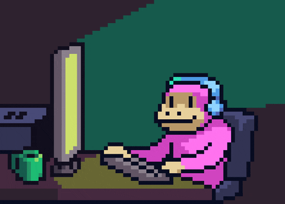

  

   
   

   
   

  
  
  
  
  

 

---

### About Me

I’m a self-taught Fullstack Developer who values clean code and a quiet place to think. I specialize in building scalable applications using Next.js and NestJS, focusing on making complex system architecture feel seamless for the end user. When I’m not solving logic puzzles in my code editor, you can usually find me in a low-key jazz bar, hiking, or overthinking a chess move.

 

  <strong>Currently Learning:</strong>  
  

 

---

### Tech Stack & Tools

 

### Frontend Development

  

### Backend Development

  

### Database & DevOps

  

---

### GitHub Analytics

 

  
  
    
  

 

---

### Beyond Code
 

<table align="center">
  <tr>
    <td align="center" width="160">
       
      <b>Running</b> 
      Hitting the pavement
    </td>
    <td align="center" width="160">
       
      <b>Chess</b> 
      Playing the game
    </td>
    <td align="center" width="160">
       
      <b>Side Projects</b> 
      Learning & building
    </td>
    <td align="center" width="160">
       
      <b>Reading</b> 
      Expanding knowledge
    </td>
  </tr>
</table>

 

---

### Let's Connect

 

I'm always open to discussing new projects, creative ideas, or opportunities to be part of your vision. Reach out to me via **Gmail**.

